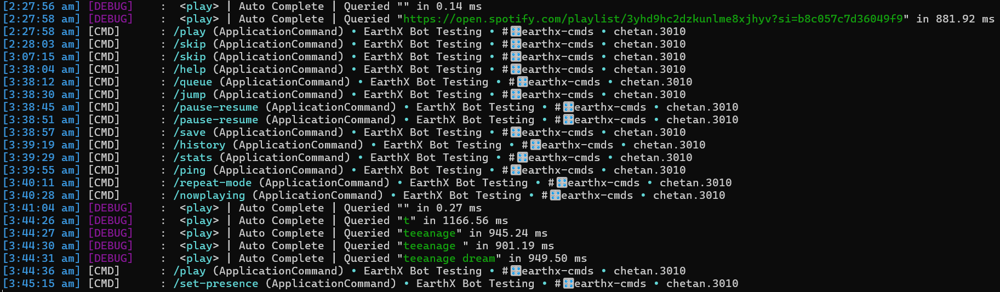
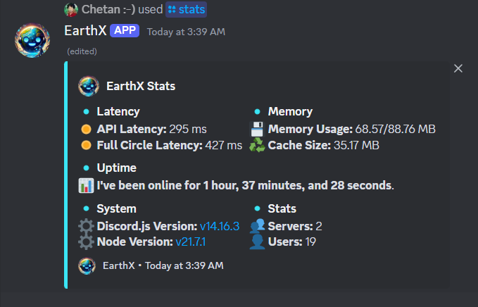
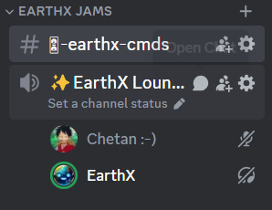
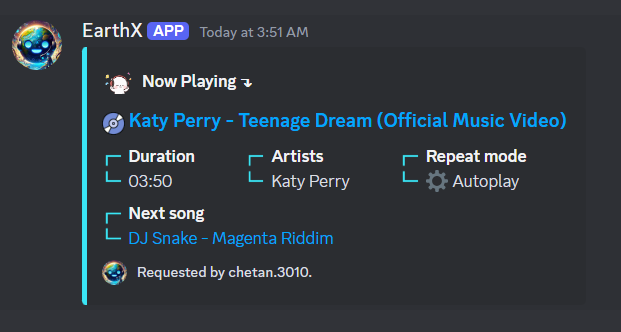
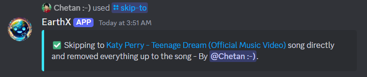
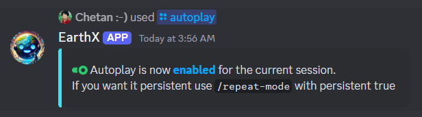
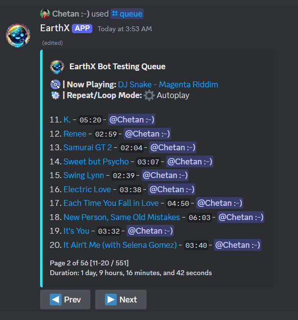
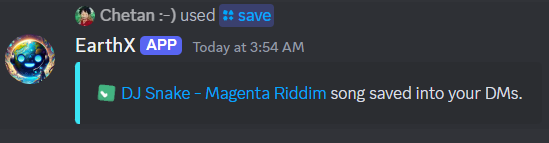
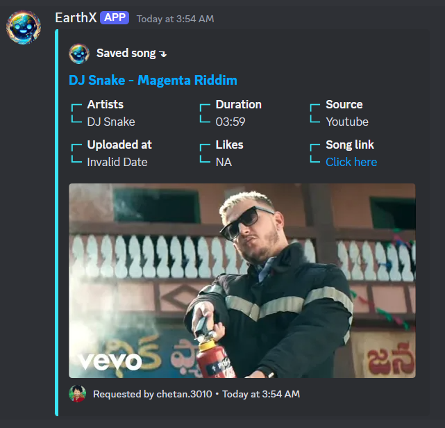

# EarthX Music Bot


EarthX is a feature-rich Discord music bot built with discord.js v14+, discord-player v6+, and MongoDB. Elevate your server's audio experience with a wide array of music commands, robust performance, intelligent chat management, and comprehensive logging!

## 📑 Table of Contents
- [✨ Features](#-features)
- [🎮 Commands](#-commands)
- [🧹 Auto-Cleanup](#-auto-cleanup)
- [📊 Logging](#-logging)
- [🖼️ Screenshots](#️-screenshots)
- [🚀 Getting Started](#-getting-started)
- [🛠️ Technologies Used](#️-technologies-used)
- [🔜 Future Plans](#-future-plans)

## ✨ Features

- 🎶 Advanced music playback with high-quality audio
- 💬 Slash commands with autocomplete for ease of use
- 🔤 Prefix command support for traditional command usage
- 🖼️ Beautiful embed responses for a sleek user interface
- 💾 MongoDB integration for persistent guild music settings
- 🚀 Built on the latest discord.js and discord-player versions
- 🧹 Automatic message cleanup for a clutter-free chat experience
- 📊 Comprehensive logging system for easy monitoring and debugging
- 🔧 Easily extendable for future feature additions
- 📱 Supports multiple music providers e.g youtube, spotify, soundcloud and etc

## 🎮 Commands

EarthX offers a variety of music-related commands to enhance your Discord server's audio experience:

- `/play` or `.play` - Start playing a song or playlist
- `/pause-resume` or `.pause-resume` - Pause/resume the current track
- `/skip` or `.skip` - Skip to the next song in the queue
- `/queue` or `.queue` - View the current music queue
- `/nowplaying` or `.nowplaying` - Display information about the current track
- `/shuffle` or `.shuffle` - Randomize the order of songs in the queue
- `/247` or `.247` - Stays on voice channel 24/7
- `/save` or `.save` - Send you the current track into dm
- `/autoplay` or `.autoplay` - Plays similar songs on empty queue

...and many more!

## 🧹 Auto-Cleanup

EarthX keeps your music channel clean and organized with its intelligent auto-cleanup feature:

- 🚫 Automatically removes outdated music status messages
- 🎵 Cleans up "Now Playing" messages when a song ends
- 📜 Removes queue messages that are no longer relevant
- 🔇 Deletes pause/resume notifications after a short time
- 💬 Keeps the chat focused on the current music experience

This feature ensures that your music channel remains clutter-free and easy to navigate, enhancing the overall user experience.

## 📊 Logging

EarthX comes with a powerful logging system that provides detailed insights into the bot's operations:

- 📝 Logs all commands executed by users
- 🎵 Tracks music playback events (play, pause, skip, etc.)
- 🔍 Records error messages for easy debugging
- 📈 Offers insights into bot performance and usage statistics

The logging system outputs clean, well-formatted logs to the console, making it easy for bot administrators to monitor activity and troubleshoot issues.



## 🖼️ Screenshots

<p align="center">
  
  
  
  
  
  
  
  
  
</p>

## 🚀 Getting Started

To add EarthX to your Discord server:

1. [Click here to invite EarthX to your server](https://discord.com/api/oauth2/authorize?client_id=YOUR_CLIENT_ID&permissions=YOUR_PERMISSIONS&scope=bot%20applications.commands)(available soon)
2. Grant the necessary permissions
3. Use `/help` or `!help` to view available commands

For developers looking to host their own instance:

1. Clone the repository:
   ```bash
   git clone https://github.com/Chetan3010/EarthX.git
   ```
2. Install dependencies:
   ```bash
   npm install
   ```
3. Install FFmpeg:
   - **For Windows**: Download the FFmpeg build from [FFmpeg's official site](https://ffmpeg.org/download.html), extract it, and add the `bin` folder to your system's PATH.
   - **For macOS**: Use Homebrew to install FFmpeg:
     ```bash
     brew install ffmpeg
     ```
   - **For Linux**: Use your package manager to install FFmpeg. For example, on Ubuntu:
     ```bash
     sudo apt update
     sudo apt install ffmpeg
     ```
4. Set up your `.example.env` file with your secrets and rename it to `.env`.

#### Prerequisite

- Discord bot/client token
- Discord bot/client id
- Spotify Client Id
- Spotify Client Secret
- MongoDB Connection String
- Discord bot owner/developer discord user id
- Community guild id
- Community guild channel id

5. Start the bot:
   ```bash
   npm start
   ```

## 🛠️ Technologies Used

- [discord.js](https://discord.js.org/) v14 - A powerful JavaScript library for interacting with the Discord API
- [discord-player](https://discord-player.js.org/) v6 - A robust framework for creating music bots
- [MongoDB](https://www.mongodb.com/) - A flexible NoSQL database for storing guild settings
- [Node.js](https://nodejs.org/) - JavaScript runtime built on Chrome's V8 JavaScript engine

## Prefix Commands
By default, prefix commands are disabled in all servers. Server administrators can enable or disable prefix commands using the `/prefix-commands` slash command.

To enable prefix commands:
1. Use `/prefix-commands enabled:true`
To disable prefix commands:
1. Use `/prefix-commands enabled:false`

## 🔜 Future Plans

I'm working to improve EarthX and expand its capabilities. Here's what's on the horizon:

- 🛡️ Moderation commands for server management
- 🎉 Fun and utility commands to entertain and assist users
- 🤖 Some AI stuff


---

<p align="center">
  Made with ❤️ by <a href="https://github.com/Chetan3010">Chetan Kale</a>
</p>
